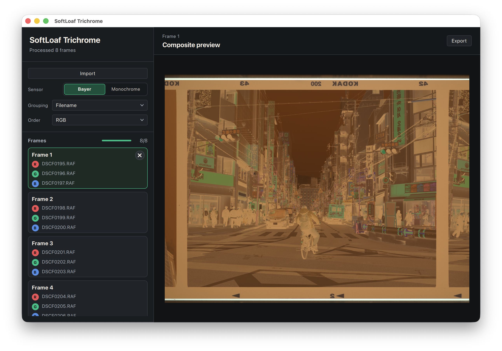
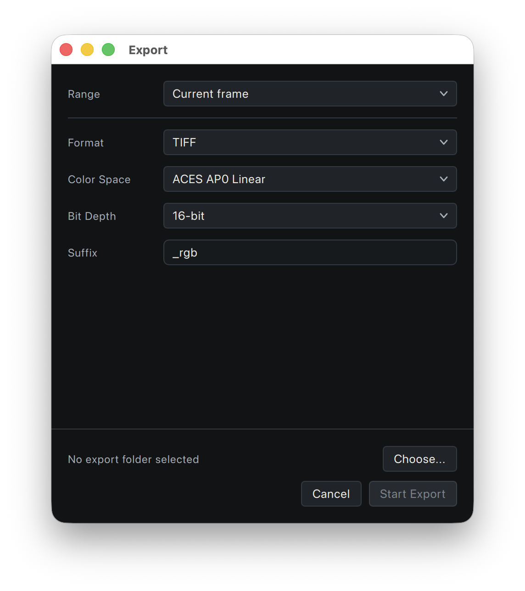

<p align="center">
  
</p>

<h1 align="center">SoftLoaf Trichrome</h1>

<p align="center">
  <strong>三次曝光，合成一张彩色影像。</strong>
</p>

<p align="center">
  <a href="./README.md">简体中文</a> ·
  <a href="./docs/README_en.md">English</a>
</p>

<p align="center">
  
  
  
  
</p>

SoftLoaf Trichrome 用来合成三色摄影图像。导入依次使用红、绿、蓝光源或滤镜
拍摄的三张照片，检查通道顺序和合成结果，然后导出 TIFF。



## 整理素材

同一张画面的三次曝光放在一起，并保持拍摄顺序。例如：

```text
DSCF0195.RAF  红光源/滤镜曝光
DSCF0196.RAF  绿光源/滤镜曝光
DSCF0197.RAF  蓝光源/滤镜曝光
DSCF0198.RAF  红光源/滤镜曝光
DSCF0199.RAF  绿光源/滤镜曝光
DSCF0200.RAF  蓝光源/滤镜曝光
```

可以导入单个文件，也可以直接导入整个文件夹。软件默认按文件名顺序，每三张
组成一个 frame；需要保留手动选择的顺序时，把 `Grouping` 改为对应选项。

如果实际拍摄顺序不是 RGB，在 `Order` 中选择 RBG、GRB、GBR、BRG 或 BGR。
设置改错了可以直接调整，不需要重新导入。

`Sensor` 用来说明源文件的类型：普通彩色相机 RAW 选择 `Bayer`，黑白相机或
已经分离好的灰度通道选择 `Monochrome`。

## 预览与导出

左侧 Frames 列出软件组成的每个 frame。选中一项后，可以在右侧检查合成结果、
通道顺序和明显的曝光或对位问题。

预览不是导出的前置步骤。导出时软件会重新读取源文件并完成合成，不需要把每个
frame 都点开看一遍。

点击右上角 `Export` 打开导出窗口。



- `Current frame`：导出当前 frame。
- `Selected frames`：导出左侧选中的完整 frames。Cmd/Ctrl+A 可以全选。
- `All complete frames`：导出所有完整 frames。

目前输出格式为 TIFF，可选 8-bit 或 16-bit，并支持常用 RGB、ProPhoto RGB 和
ACES 色彩空间。后续还要调色时，通常选择 16-bit。

## 文件格式

支持常见相机 RAW，以及 TIFF、JPEG 和 PNG。能读取某种 RAW 文件，只表示软件
可以处理该文件格式，不代表对应相机已经完成色彩准确性验证。具体记录见
[RAW correctness report](docs/raw_correctness_report.md)。

## 许可证

源代码使用 [GNU General Public License v3.0](LICENSE)。分发修改版本或二进制
文件时，需要按照 GPLv3 提供对应源代码。

`SoftLoaf`、`SoftLoaf Trichrome`、官方图标、签名身份和商店信息不包含在 GPLv3
授权中，详见 [TRADEMARKS.md](TRADEMARKS.md) 和
[COMMERCIAL_LICENSE.md](COMMERCIAL_LICENSE.md)。第三方依赖见
[THIRD_PARTY_NOTICES.md](THIRD_PARTY_NOTICES.md)。
